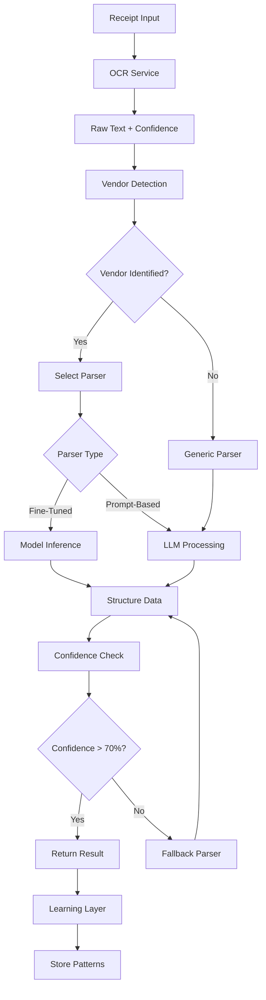

# Production OCR Architecture: Vendor-Specific Receipt Processing

## Architecture Overview

### Core Principle: Progressive Enhancement
Start with vendor-specific prompts, evolve to fine-tuned models for high-volume vendors.

## System Components

### 1. Pure OCR Layer
**Purpose**: Extract raw text without interpretation

```typescript
interface OCRService {
  providers: {
    primary: 'tesseract' | 'aws-textract' | 'google-vision'
    fallback: 'azure-vision' | 'mistral-vision'
  }
  extractText(image: ImageInput): Promise<RawOCRResult>
}

interface RawOCRResult {
  rawText: string
  confidence: number
  boundingBoxes: BoundingBox[]
  processingTime: number
  cost: number
}
```

### 2. Vendor Detection Engine
**Purpose**: Identify vendor from OCR text + visual cues

```typescript
interface VendorDetectionResult {
  vendor: VendorType
  confidence: number
  detectionMethod: 'text' | 'logo' | 'pattern' | 'hybrid'
  fallbackToGeneric: boolean
}

enum VendorType {
  WALMART = 'walmart',
  HOME_DEPOT = 'home_depot',
  TARGET = 'target',
  COSTCO = 'costco',
  AMAZON = 'amazon',
  GENERIC = 'generic'
}
```

**Detection Methods:**
1. **Text Pattern Matching**: Look for vendor names, addresses, phone numbers
2. **Logo Recognition**: Visual logo detection using simple CNN
3. **Format Patterns**: Unique receipt layouts and structures
4. **Hybrid Scoring**: Combine multiple signals

### 3. Parser Matrix System
Route to appropriate parsing strategy based on vendor and volume:

```typescript
interface ParserMatrix {
  getParser(vendor: VendorType, volume: VendorVolume): Parser
}

enum VendorVolume {
  HIGH = 'high',      // >1000 receipts/month - Use fine-tuned model
  MEDIUM = 'medium',  // 100-1000/month - Use optimized prompts  
  LOW = 'low'         // <100/month - Use generic prompts
}

interface Parser {
  name: string
  type: 'fine_tuned' | 'prompt_template' | 'generic'
  process(rawText: string, context: ParsingContext): Promise<ReceiptData>
  confidence: number
  cost: number
}
```

## 4. Vendor-Specific Parsing Strategies

### Walmart-Specific Parser
**Challenge**: Complex pricing like "6 AT 1 FOR 0.78 = 4.68"

```typescript
const WALMART_PATTERNS = {
  multiItemPricing: /(\d+)\s+AT\s+(\d+)\s+FOR\s+(\d+\.\d{2})\s*=\s*(\d+\.\d{2})/gi,
  simpleItem: /^([A-Z0-9\s]+)\s+(\d+\.\d{2})\s*([TFNX]?)$/gm,
  taxableIndicator: /[TFNX]$/,
  subtotal: /SUBTOTAL\s+(\d+\.\d{2})/i,
  tax: /TAX\s+(\d+\.\d{2})/i,
  total: /TOTAL\s+(\d+\.\d{2})/i
}

async function parseWalmart(rawText: string): Promise<ReceiptData> {
  const items: LineItem[] = []
  
  // Handle multi-item pricing
  const multiItemMatches = rawText.matchAll(WALMART_PATTERNS.multiItemPricing)
  for (const match of multiItemMatches) {
    const [, quantity, forQuantity, unitPrice, totalPrice] = match
    const actualQuantity = parseInt(quantity)
    const pricePerUnit = parseFloat(totalPrice) / actualQuantity
    
    items.push({
      description: extractItemDescription(match.index, rawText),
      quantity: actualQuantity,
      unitPrice: pricePerUnit,
      totalPrice: parseFloat(totalPrice),
      category: categorizeItem(description),
      vendorSpecific: {
        pricingPattern: 'multi_item',
        originalText: match[0]
      }
    })
  }
  
  // Handle simple items
  const simpleMatches = rawText.matchAll(WALMART_PATTERNS.simpleItem)
  for (const match of simpleMatches) {
    items.push(parseSimpleItem(match))
  }
  
  return buildReceiptData(items, rawText)
}
```

### Home Depot Parser
**Patterns**: SKU-based items, bulk pricing, contractor discounts

```typescript
const HOME_DEPOT_PATTERNS = {
  skuItem: /(\d{12})\s+([A-Z0-9\s]+)\s+(\d+\.\d{2})/gm,
  bulkDiscount: /BULK\s+DISCOUNT\s+-(\d+\.\d{2})/i,
  contractorDiscount: /CONTRACTOR\s+DISCOUNT\s+-(\d+\.\d{2})/i
}
```

### Target Parser  
**Patterns**: Cartwheel discounts, RedCard discounts, gift card payments

### Costco Parser
**Patterns**: Membership-based pricing, bulk quantities, executive rewards

## 5. Data Flow and Pipeline



## 6. Vendor Detection Strategy

### Text-Based Detection
```typescript
const VENDOR_SIGNATURES = {
  walmart: {
    required: ['walmart', 'save money'],
    phone: ['1-800-walmart'],
    addresses: ['bentonville', 'ar'],
    confidence: 0.9
  },
  home_depot: {
    required: ['home depot', 'more saving'],
    phone: ['1-800-home-depot'],
    websites: ['homedepot.com'],
    confidence: 0.85
  },
  target: {
    required: ['target', 'expect more'],
    phone: ['1-800-target'],
    loyalty: ['redcard', 'cartwheel'],
    confidence: 0.85
  }
}
```

### Logo Recognition (Lightweight CNN)
```typescript
interface LogoDetector {
  detectLogo(image: ImageBuffer): Promise<LogoDetectionResult>
  confidence: number
  processingTime: number
}

// Pre-trained lightweight model for major retailers
const logoModels = {
  walmart: 'walmart-logo-v1.onnx',
  target: 'target-logo-v1.onnx',
  homedepot: 'homedepot-logo-v1.onnx'
}
```

## 7. Storage/Caching Strategy

### Redis Cache Layer
```typescript
interface CacheStrategy {
  // Cache parsed results for identical receipts
  receiptCache: Map<string, ReceiptData> // 24 hour TTL
  
  // Cache vendor detection for similar layouts
  vendorCache: Map<string, VendorType> // 7 day TTL
  
  // Cache parsing patterns that work
  patternCache: Map<string, ParsePattern> // 30 day TTL
}
```

### Database Schema Enhancement
```sql
-- Vendor-specific patterns storage
CREATE TABLE vendor_patterns (
  id UUID PRIMARY KEY,
  vendor_type VARCHAR(50) NOT NULL,
  pattern_type VARCHAR(50) NOT NULL, -- 'pricing', 'discount', 'tax'
  regex_pattern TEXT NOT NULL,
  confidence_score DECIMAL(3,2) NOT NULL,
  usage_count INTEGER DEFAULT 0,
  success_rate DECIMAL(3,2) DEFAULT 0.00,
  created_at TIMESTAMP DEFAULT NOW(),
  updated_at TIMESTAMP DEFAULT NOW()
);

-- Receipt parsing history for learning
CREATE TABLE parsing_history (
  id UUID PRIMARY KEY,
  receipt_id UUID REFERENCES receipt(id),
  vendor_detected VARCHAR(50),
  parser_used VARCHAR(50),
  confidence_score DECIMAL(3,2),
  success BOOLEAN,
  user_corrections JSONB, -- Store any manual corrections
  processing_time INTEGER, -- milliseconds
  created_at TIMESTAMP DEFAULT NOW()
);
```

## 8. Performance and Cost Analysis

### Processing Performance
| Component | Processing Time | Cost |
|-----------|----------------|------|
| OCR (Tesseract) | 500-1000ms | $0.00001 |
| OCR (AWS Textract) | 200-500ms | $0.0015 |
| Vendor Detection | 50-100ms | $0.00001 |
| Prompt-Based Parser | 1000-3000ms | $0.0003 |
| Fine-Tuned Parser | 100-300ms | $0.00002 |
| **Total (Prompt)** | **1.5-4.5s** | **$0.0005-0.002** |
| **Total (Fine-Tuned)** | **0.8-1.9s** | **$0.0002-0.002** |

### Cost Projections
| Volume | Monthly Cost (Prompt) | Monthly Cost (Hybrid) |
|--------|---------------------|---------------------|
| 1,000 receipts | $0.50-2.00 | $0.20-1.50 |
| 10,000 receipts | $5.00-20.00 | $2.00-15.00 |
| 100,000 receipts | $50.00-200.00 | $20.00-150.00 |

## 9. Implementation Phases

### Phase 1: Enhanced Prompt System (2-3 weeks)
1. Implement pure OCR layer with Tesseract + AWS Textract fallback
2. Build vendor detection engine with text patterns
3. Create vendor-specific prompt templates for top 5 vendors
4. Add confidence scoring and fallback logic
5. Implement caching layer

**Deliverables:**
- Enhanced OCR service with vendor detection
- Walmart, Home Depot, Target, Costco, Amazon parsers
- Confidence-based routing
- Performance monitoring

### Phase 2: Learning Layer (2-3 weeks)
1. Implement parsing history tracking
2. Add user correction feedback system
3. Build pattern learning pipeline
4. Create performance analytics dashboard
5. Add A/B testing framework for prompt optimization

**Deliverables:**
- Learning and feedback system
- Pattern optimization engine
- Analytics dashboard
- A/B testing infrastructure

### Phase 3: Fine-Tuned Models (3-6 months)
1. Collect training data for high-volume vendors (Walmart, Home Depot)
2. Train and deploy fine-tuned models
3. Implement model serving infrastructure
4. Build gradual migration system
5. Add model performance monitoring

**Deliverables:**
- Fine-tuned models for top 2 vendors
- Model serving infrastructure
- Performance comparison system
- Migration tools

## 10. Vendor-Specific Pattern Handling

### Walmart Patterns Implementation
```typescript
interface WalmartPatterns {
  // Multi-item pricing: "6 AT 1 FOR 0.78 = 4.68"
  parseMultiItemPricing(text: string): LineItem[]
  
  // Bulk discounts: "ROLLBACK -$2.00"
  parseRollbackDiscounts(text: string): Discount[]
  
  // Savings catcher: "SAVINGS CATCHER ELIGIBLE"
  parseSavingsCatcher(text: string): boolean
  
  // Grocery vs General merchandise tax handling
  parseWalmartTax(items: LineItem[]): TaxBreakdown
}

class WalmartParser extends VendorParser {
  async parse(rawText: string): Promise<ReceiptData> {
    const lines = rawText.split('\n')
    const items: LineItem[] = []
    
    for (let i = 0; i < lines.length; i++) {
      const line = lines[i].trim()
      
      // Multi-item pricing pattern
      const multiMatch = line.match(/(\d+)\s+AT\s+(\d+)\s+FOR\s+(\d+\.\d{2})\s*=\s*(\d+\.\d{2})/i)
      if (multiMatch) {
        const [, quantity, _, unitPrice, totalPrice] = multiMatch
        const description = this.findItemDescription(lines, i)
        
        items.push({
          description,
          quantity: parseInt(quantity),
          unitPrice: parseFloat(totalPrice) / parseInt(quantity),
          totalPrice: parseFloat(totalPrice),
          category: this.categorizeWalmartItem(description),
          metadata: {
            pricingType: 'multi_item',
            originalPattern: multiMatch[0]
          }
        })
        continue
      }
      
      // Regular item pattern
      const itemMatch = line.match(/^([A-Z0-9\s\-\/]+?)\s+(\d+\.\d{2})\s*([NXFT])?$/i)
      if (itemMatch) {
        items.push(this.parseRegularItem(itemMatch))
      }
    }
    
    return this.buildWalmartReceipt(items, rawText)
  }
}
```

## 11. Fallback Strategies

### Multi-Level Fallback System
```typescript
interface FallbackStrategy {
  level1: 'vendor_specific_prompt'
  level2: 'generic_optimized_prompt' 
  level3: 'basic_extraction'
  level4: 'manual_review_queue'
}

async function processWithFallback(rawText: string, vendor?: VendorType): Promise<ReceiptData> {
  let result: ReceiptData | null = null
  
  // Level 1: Vendor-specific parsing
  if (vendor && vendor !== VendorType.GENERIC) {
    result = await parseWithVendorSpecificLogic(rawText, vendor)
    if (result && result.confidence >= 70) return result
  }
  
  // Level 2: Generic optimized parsing
  result = await parseWithOptimizedPrompt(rawText)
  if (result && result.confidence >= 60) return result
  
  // Level 3: Basic extraction
  result = await parseWithBasicPatterns(rawText)
  if (result && result.confidence >= 40) return result
  
  // Level 4: Queue for manual review
  await queueForManualReview(rawText, result)
  return result || getMinimalReceiptData(rawText)
}
```

### Error Recovery
```typescript
interface ErrorRecovery {
  // When vendor detection fails
  handleUnknownVendor(rawText: string): Promise<ReceiptData>
  
  // When parsing confidence is low
  handleLowConfidence(result: ReceiptData): Promise<ReceiptData>
  
  // When critical fields are missing
  handleMissingFields(result: ReceiptData): Promise<ReceiptData>
  
  // When line items don't add up to total
  handleMathDiscrepancies(result: ReceiptData): Promise<ReceiptData>
}
```

This architecture provides a pragmatic approach that delivers immediate value while building toward more sophisticated capabilities. The hybrid system allows you to start with prompts and gradually evolve high-volume vendors to fine-tuned models as you collect data and prove ROI.