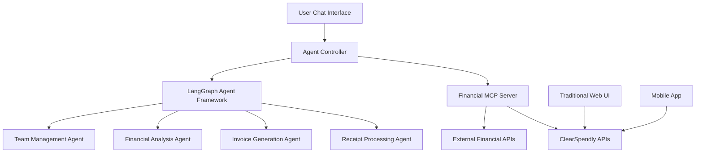

# AI Agent Architecture Proposal
*Transforming ClearSpendly into an Agentic Financial Management Platform*

## 🎯 Vision

Transform ClearSpendly from a traditional financial management app into an AI-powered agentic platform where users can interact with their financial data through natural language and automated workflows.

## 🏗️ Proposed Architecture

### Core Concept
```
User Chat → Agent Controller → Financial MCP Server → ClearSpendly APIs
                            → External Financial APIs
```

### Architecture Components



## 📋 Implementation Phases

### Phase 1: MCP Foundation (Weeks 1-2)
**Goal:** Build the financial tools MCP server

**Deliverables:**
```typescript
// financial-mcp-server/
├── tools/
│   ├── receipt-tools.ts     // Create, search, categorize receipts
│   ├── invoice-tools.ts     // Generate, send, track invoices
│   ├── expense-tools.ts     // Analyze, report, export expenses
│   ├── payment-tools.ts     // Record, track payments
│   ├── mileage-tools.ts     // Log, calculate mileage deductions
│   └── team-tools.ts        // Manage team permissions
├── auth/
│   └── permission-wrapper.ts // Handle role-based access control
├── context/
│   └── financial-context.ts  // Maintain conversation financial context
└── server.ts                // Main MCP server entry point
```

**Key Features:**
- **Permission-aware tools** - Respect existing role-based access control
- **Context management** - Maintain financial state across conversations
- **Rate limiting** - Prevent AI from overwhelming APIs
- **Audit logging** - Track all AI-performed financial operations

### Phase 2: Agent Framework (Weeks 3-4)
**Goal:** Build specialized financial agents using LangGraph

**Agent Specifications:**

#### Receipt Processing Agent
```typescript
// Workflow: Image → OCR → Categorization → Validation → Save
capabilities:
  - Bulk receipt processing from folders/emails
  - Smart categorization using historical patterns
  - Vendor matching and normalization
  - Tax calculation and compliance checks
```

#### Invoice Generation Agent
```typescript
// Workflow: Client Data → Template Selection → Generation → Review → Send
capabilities:
  - Auto-generate invoices from time logs/projects
  - Template selection based on client preferences
  - Payment terms and tax calculations
  - Automated follow-up sequences
```

#### Financial Analysis Agent
```typescript
// Workflow: Query → Data Aggregation → Analysis → Visualization → Insights
capabilities:
  - Trend analysis and forecasting
  - Expense optimization recommendations
  - Tax planning and deadline reminders
  - Cash flow projections
```

#### Team Management Agent
```typescript
// Workflow: Team Query → Permission Check → Action → Notification
capabilities:
  - Role-based team member management
  - Permission assignments and reviews
  - Activity monitoring and reporting
  - Onboarding automation
```

### Phase 3: Chat Integration (Weeks 5-6)
**Goal:** Build rich chat interface with financial UI components

**Features:**
- **Streaming responses** for long-running operations
- **Rich components** (receipt previews, expense charts, invoice PDFs)
- **Action confirmations** for all financial operations
- **Conversation memory** with financial context persistence
- **Multi-modal input** (text, voice, images, documents)

## 🛠️ Technology Stack

### MCP Server
- **Framework:** TypeScript MCP SDK
- **Authentication:** JWT with role-based permissions
- **Database:** Supabase (existing)
- **Logging:** Structured JSON logs with audit trails

### Agent Framework
- **Primary:** LangGraph for complex financial workflows
- **Alternative:** CrewAI for multi-agent coordination
- **Models:** Configurable (GPT-4, Claude, local models)
- **Memory:** Redis for conversation context

### Chat Interface
- **Base:** Open WebUI or Chatbot UI (don't build from scratch)
- **Components:** Custom financial components (charts, receipts, invoices)
- **Real-time:** WebSockets for streaming responses
- **Mobile:** Progressive Web App (PWA)

## 🔥 Killer Use Cases

### Immediate Value Propositions

1. **"Process all receipts from my email this month"**
   - Agent scans email attachments
   - OCR processes each receipt
   - Auto-categorizes based on patterns
   - Saves to appropriate accounts

2. **"Generate and send invoices for all completed projects"**
   - Reviews project completion status
   - Applies appropriate templates and rates
   - Generates professional invoices
   - Sends via email with tracking

3. **"What are my top tax deductions this quarter?"**
   - Analyzes all categorized expenses
   - Identifies tax-deductible items
   - Calculates potential savings
   - Suggests optimization strategies

4. **"Set up auto-categorization for grocery receipts"**
   - Creates smart rules based on vendor patterns
   - Monitors accuracy and adjusts
   - Handles edge cases intelligently

5. **"Prepare my monthly financial summary for the team"**
   - Aggregates relevant team metrics
   - Creates visual dashboard
   - Generates executive summary
   - Schedules automatic distribution

## 🚨 Critical Challenges & Solutions

### 1. Financial Data Security
**Challenges:**
- Sensitive financial data in AI conversations
- Audit requirements for financial operations
- Compliance with financial regulations

**Solutions:**
- **Zero-log policy** for financial data in chat systems
- **Comprehensive audit trails** for all AI actions
- **User confirmation** required for all money operations
- **Encryption** at rest and in transit
- **Rate limiting** to prevent AI abuse

### 2. Context & Memory Management
**Challenges:**
- Maintaining financial context across conversations
- User preferences and historical patterns
- Multi-tenant data isolation

**Solutions:**
- **Conversation persistence** with encrypted storage
- **Financial context objects** (current period, accounts, etc.)
- **User preference learning** and adaptation
- **Tenant-aware context** isolation

### 3. Error Handling & Recovery
**Challenges:**
- API failures during critical operations
- Partial success scenarios
- Complex decision points requiring human input

**Solutions:**
- **Graceful degradation** with fallback options
- **Partial success reporting** with retry mechanisms
- **Human escalation** for ambiguous cases
- **Transaction rollback** capabilities

### 4. Multi-tenant Scaling
**Challenges:**
- Agent performance across multiple tenants
- Resource allocation and limits
- Custom workflows per tenant

**Solutions:**
- **Agent pooling** with tenant isolation
- **Usage-based throttling** per plan tier
- **Configurable workflows** per tenant preferences

## 🎯 Success Metrics

### Technical Metrics
- **API Response Time:** <200ms for simple operations
- **Agent Accuracy:** >95% for receipt categorization
- **Uptime:** 99.9% availability
- **Processing Speed:** 10+ receipts per minute

### Business Metrics
- **User Engagement:** 50% increase in daily active users
- **Feature Adoption:** 80% of users try AI features within 30 days
- **Time Savings:** 70% reduction in manual data entry
- **Customer Satisfaction:** >4.5/5 rating for AI features

### Financial Metrics
- **Revenue Impact:** 30% increase in premium plan conversions
- **Retention:** 25% improvement in user retention
- **Support Reduction:** 40% decrease in support tickets
- **Expansion Revenue:** 20% increase in per-user revenue

## 🔄 Future Roadmap

### Phase 4: Advanced Intelligence (Months 2-3)
- **Predictive analytics** for cash flow and expenses
- **Smart budgeting** with automatic adjustments
- **Tax optimization** recommendations
- **Fraud detection** and alerts

### Phase 5: External Integrations (Months 3-4)
- **Bank account connections** for automatic transaction import
- **QuickBooks/Xero** synchronization
- **Payment processor** integrations (Stripe, PayPal)
- **CRM integration** for client billing automation

### Phase 6: Enterprise Features (Months 4-6)
- **Custom agent workflows** per enterprise client
- **SSO integration** with corporate identity providers
- **Advanced compliance** reporting and audit trails
- **API access** for third-party integrations

## 💡 Implementation Strategy

### Start Small, Scale Fast
1. **MVP:** Single agent (receipt processing) with basic chat
2. **Validate:** User feedback and usage patterns
3. **Expand:** Add more agents based on user demand
4. **Scale:** Multi-tenant optimization and enterprise features

### Technology Decisions
- **Model Strategy:** Start with hosted models (GPT-4/Claude), add local options later
- **UI Strategy:** Enhance existing web UI rather than rebuild
- **Deployment:** Cloud-native with auto-scaling
- **Monitoring:** Comprehensive observability from day one

## 📊 Resource Requirements

### Development Team
- **1 Senior Full-stack Developer** (MCP + Agent Framework)
- **1 AI/ML Engineer** (Agent optimization and model integration)
- **1 Frontend Developer** (Chat UI and components)
- **1 DevOps Engineer** (Infrastructure and monitoring)

### Infrastructure
- **Agent Hosting:** Cloud GPU instances for model inference
- **MCP Server:** Standard web hosting with Redis
- **Storage:** Encrypted blob storage for conversation history
- **Monitoring:** APM and log aggregation services

### Timeline
- **Phase 1:** 2 weeks (MCP Foundation)
- **Phase 2:** 2 weeks (Basic Agents)
- **Phase 3:** 2 weeks (Chat Integration)
- **Total MVP:** 6 weeks to working prototype

## 🎯 Go/No-Go Decision Points

### Technical Feasibility
- ✅ **API Readiness:** Existing APIs are well-structured for MCP integration
- ✅ **Permission System:** Role-based access control already implemented
- ✅ **Data Model:** Financial data structure supports agent operations
- ⚠️ **Scale Requirements:** Need to validate multi-tenant performance

### Business Justification
- ✅ **Market Demand:** AI automation is highly requested feature
- ✅ **Competitive Advantage:** Few financial apps have true agentic capabilities
- ✅ **Monetization:** Clear path to premium feature pricing
- ⚠️ **Development Cost:** Significant engineering investment required

### Risk Assessment
- **Technical Risk:** Medium (proven technologies, clear architecture)
- **Market Risk:** Low (strong user demand validation)
- **Competitive Risk:** Low (early mover advantage)
- **Financial Risk:** Medium (significant development investment)

## 📋 Next Steps

1. **Technical Validation**
   - Build simple MCP server proof-of-concept
   - Test with basic receipt processing agent
   - Validate performance and security model

2. **User Research**
   - Survey existing users on AI feature priorities
   - Conduct user interviews on workflow pain points
   - Validate key use cases and user stories

3. **Business Planning**
   - Define pricing strategy for AI features
   - Create development budget and timeline
   - Establish success metrics and KPIs

4. **Infrastructure Planning**
   - Design multi-tenant agent architecture
   - Plan monitoring and observability strategy
   - Establish security and compliance framework

---

*This document represents the strategic vision for transforming ClearSpendly into an AI-powered agentic financial platform. The architecture is designed to be scalable, secure, and user-centric while leveraging the existing strong foundation of APIs and user management systems.*