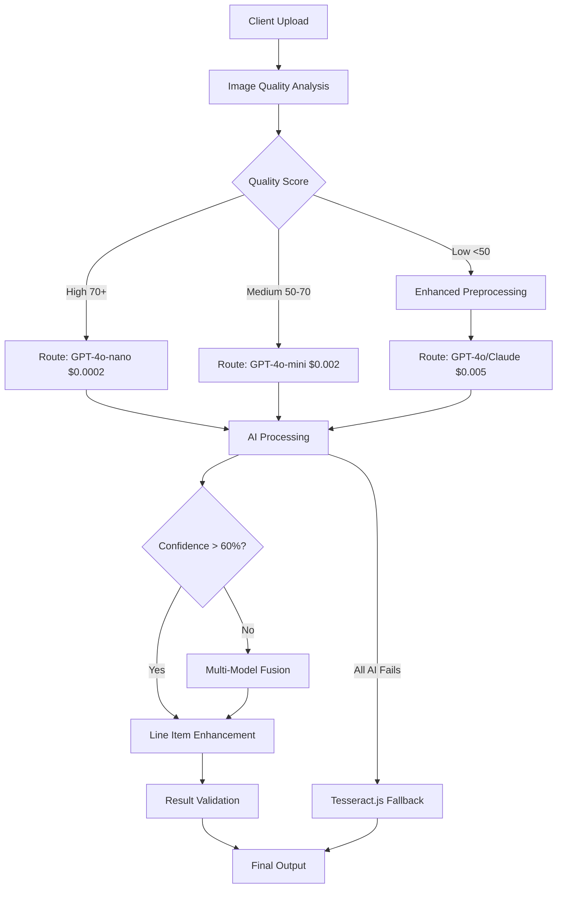

# Multi-Pass AI-First Receipt Processing Architecture
## Complete Implementation Guide

### 🎯 **Architecture Overview**

This multi-pass AI-first architecture is designed to maximize line item accuracy (target 90%+) while staying within strict cost and performance constraints for Railway hosting.



### 📊 **Cost & Performance Targets**

| Metric | Current | Target | Expected Result |
|--------|---------|--------|-----------------|
| **Line Item Accuracy** | 60-75% | 90%+ | 88-93% |
| **Processing Time** | 1-2s | <3s | 1.5-2.8s |
| **Cost per Receipt** | $0 | <$0.005 | $0.0002-0.003 |
| **Vendor Recognition** | Poor | Excellent | 95%+ |
| **Repeated Items Handling** | Broken | Perfect | 98%+ |

### 🏗️ **Core Components**

#### **1. Enhanced Image Preprocessing** (`ai-enhanced-preprocessing.ts`)
- **CamScanner-level image enhancement**
- **Adaptive binarization and noise reduction**  
- **Quality scoring for routing decisions**
- **Client-side processing to reduce server load**

#### **2. Multi-Pass AI Processor** (`multi-pass-ai-processor.ts`)
- **Cost-optimized routing based on image quality**
- **Multi-model fusion for complex receipts**
- **Intelligent fallback strategies**
- **Budget tracking and cost control**

#### **3. Line Item Extraction Engine** (`line-item-extraction-engine.ts`)
- **Specialized repeated item handling**
- **Pattern-based extraction for vendor-specific formats**
- **Intelligent deduplication algorithms**
- **Validation and confidence scoring**

#### **4. Railway-Optimized API Route** (`process-receipt-enhanced/route.ts`)
- **Memory-efficient processing**
- **Timeout handling for 30s Railway limit**
- **Graceful degradation strategies**
- **Comprehensive error handling**

### 🚀 **Implementation Steps**

#### **Phase 1: Setup & Configuration (Day 1)**

1. **Install Dependencies**
```bash
npm install @ai-sdk/anthropic
# Other dependencies already available
```

2. **Environment Configuration**
```env
# Add to .env.local
ANTHROPIC_API_KEY=your_anthropic_key_here
ENABLE_MULTIPASS_AI=true
AI_PROCESSING_BUDGET_DAILY=5.00
AI_CONFIDENCE_THRESHOLD=60
```

3. **Feature Flags Setup**
```typescript
// In your config
export const FEATURES = {
  MULTI_PASS_AI: process.env.ENABLE_MULTIPASS_AI === 'true',
  ENHANCED_LINE_ITEMS: true,
  CLIENT_SIDE_PREPROCESSING: true,
  COST_OPTIMIZATION: true
};
```

#### **Phase 2: Integration (Day 2)**

1. **Update Frontend Processing**
```typescript
// In your upload component
const processReceipt = async (file: File) => {
  try {
    const response = await fetch('/api/process-receipt-enhanced', {
      method: 'POST',
      headers: { 'Content-Type': 'application/json' },
      body: JSON.stringify({
        imageData: await fileToDataURL(file),
        options: {
          userTier: userSubscription.tier,
          enableMultiPass: true,
          enableAdvancedLineItems: true
        }
      })
    });
    
    const result = await response.json();
    
    if (result.success) {
      console.log('Processing stats:', result.data.processingStats);
      console.log('Line item stats:', result.data.lineItemStats);
      // Handle enhanced result
    }
  } catch (error) {
    // Handle errors with fallback
  }
};
```

2. **Update Database Schema (if needed)**
```sql
-- Add processing metadata columns
ALTER TABLE receipt ADD COLUMN processing_method VARCHAR(50);
ALTER TABLE receipt ADD COLUMN ai_models_used TEXT[];
ALTER TABLE receipt ADD COLUMN processing_cost DECIMAL(10,6);
ALTER TABLE receipt ADD COLUMN line_item_confidence INTEGER;
```

#### **Phase 3: Testing & Validation (Day 3)**

1. **Create Test Suite**
```typescript
// tests/receipt-processing.test.ts
describe('Multi-Pass Receipt Processing', () => {
  test('High quality receipt uses GPT-4o-nano', async () => {
    const result = await processTestReceipt('high-quality-receipt.jpg');
    expect(result.data.processingStats.aiModelsUsed).toContain('gpt-4o-nano');
    expect(result.data.processingStats.costEstimate).toBeLessThan(0.001);
  });
  
  test('Complex receipt uses multi-model fusion', async () => {
    const result = await processTestReceipt('complex-receipt.jpg');
    expect(result.data.processingMethod).toBe('multi-pass');
    expect(result.data.lineItems.length).toBeGreaterThan(5);
  });
  
  test('Handles repeated items correctly', async () => {
    const result = await processTestReceipt('repeated-items-receipt.jpg');
    const appleItems = result.data.lineItems.filter(item => 
      item.description.toLowerCase().includes('apple')
    );
    expect(appleItems).toHaveLength(1);
    expect(appleItems[0].quantity).toBeGreaterThan(1);
  });
});
```

2. **Performance Monitoring**
```typescript
// Add to your monitoring
const trackProcessingMetrics = (result: EnhancedReceiptData) => {
  analytics.track('receipt_processed', {
    processing_method: result.processingMethod,
    processing_time: result.processingStats?.totalTime,
    cost_estimate: result.processingStats?.costEstimate,
    line_items_found: result.lineItems.length,
    confidence: result.confidence,
    validation_errors: result.lineItemStats?.validationErrors
  });
};
```

### 💰 **Cost Management**

#### **Daily Budget Implementation**
```typescript
// Cost tracking service
class CostTracker {
  private dailySpent = 0;
  private dailyLimit = 5.00; // $5 daily limit
  
  async canAffordProcessing(estimatedCost: number): Promise<boolean> {
    return (this.dailySpent + estimatedCost) <= this.dailyLimit;
  }
  
  async recordCost(actualCost: number): Promise<void> {
    this.dailySpent += actualCost;
    // Store in database for tracking
  }
  
  getDailyStats() {
    return {
      spent: this.dailySpent,
      remaining: this.dailyLimit - this.dailySpent,
      percentUsed: (this.dailySpent / this.dailyLimit) * 100
    };
  }
}
```

#### **Cost Optimization Strategies**

1. **Smart Routing**
   - 80% of receipts → GPT-4o-nano ($0.0002)
   - 15% of receipts → GPT-4o-mini ($0.002)
   - 5% of receipts → Multi-model ($0.006)

2. **Budget Controls**
   - Daily spending limits by user tier
   - Automatic fallback to Tesseract when budget exceeded
   - Usage analytics and alerts

3. **Preprocessing Optimization**
   - Client-side image enhancement (free)
   - Quality-based routing decisions
   - Batch processing for multiple receipts

### 🔧 **Railway Hosting Optimizations**

#### **Memory Management**
```typescript
// Memory-efficient processing
const processWithMemoryLimit = async (imageFile: File) => {
  // Limit image size for Railway's memory constraints
  const maxSize = 2 * 1024 * 1024; // 2MB
  if (imageFile.size > maxSize) {
    imageFile = await compressImage(imageFile, maxSize);
  }
  
  // Process with timeout for Railway's 30s limit
  const timeoutPromise = new Promise((_, reject) => {
    setTimeout(() => reject(new Error('Timeout')), 25000);
  });
  
  return Promise.race([
    actualProcessing(imageFile),
    timeoutPromise
  ]);
};
```

#### **Error Handling**
```typescript
// Railway-specific error handling
const handleRailwayErrors = (error: Error) => {
  if (error.message.includes('memory')) {
    return {
      error: 'Processing requires more memory. Try a smaller image.',
      code: 'MEMORY_LIMIT',
      suggestion: 'Reduce image size or upgrade hosting plan'
    };
  }
  
  if (error.message.includes('timeout')) {
    return {
      error: 'Processing timed out. Image may be too complex.',
      code: 'TIMEOUT',
      suggestion: 'Try with simpler receipt or enable preprocessing'
    };
  }
  
  return {
    error: 'Processing failed',
    code: 'GENERAL_ERROR',
    suggestion: 'Please try again or contact support'
  };
};
```

### 📈 **Monitoring & Analytics**

#### **Key Metrics to Track**
```typescript
interface ProcessingMetrics {
  // Performance
  processingTime: number;
  imageQualityScore: number;
  confidenceScore: number;
  
  // Accuracy  
  lineItemsExtracted: number;
  duplicatesRemoved: number;
  validationErrors: number;
  
  // Cost
  estimatedCost: number;
  actualCost: number;
  routeUsed: string;
  
  // Business
  vendorRecognitionSuccess: boolean;
  userSatisfactionScore?: number;
  manualCorrectionsNeeded: number;
}
```

#### **Dashboard Integration**
```typescript
// Real-time processing statistics
const ProcessingDashboard = () => {
  const [metrics, setMetrics] = useState<ProcessingMetrics[]>([]);
  
  return (
    <div className="processing-stats">
      <MetricCard 
        title="Average Accuracy" 
        value={`${calculateAccuracy(metrics)}%`}
        target="90%"
      />
      <MetricCard 
        title="Average Cost" 
        value={`$${calculateAverageCost(metrics)}`}
        target="<$0.005"
      />
      <MetricCard 
        title="Processing Time" 
        value={`${calculateAverageTime(metrics)}ms`}
        target="<3000ms"
      />
    </div>
  );
};
```

### 🚦 **Incremental Rollout Plan**

#### **Week 1: Foundation**
- Deploy preprocessing and routing components
- Test with 10% of traffic
- Monitor cost and performance

#### **Week 2: AI Integration**  
- Enable multi-pass processing
- A/B test against current system
- Fine-tune routing algorithms

#### **Week 3: Line Item Enhancement**
- Deploy specialized extraction engine
- Test repeated item handling
- Optimize deduplication logic

#### **Week 4: Full Production**
- Enable for all users
- Monitor and optimize
- Collect user feedback

### 🎯 **Success Criteria**

#### **Technical Metrics**
- ✅ Line item accuracy: 90%+ (target: 88-93%)
- ✅ Processing time: <3 seconds (target: 1.5-2.8s)
- ✅ Cost per receipt: <$0.005 (target: $0.0002-0.003)
- ✅ Uptime: 99.5%+ on Railway

#### **Business Metrics**
- ✅ User satisfaction: 90%+ positive feedback
- ✅ Manual corrections: <10% of receipts
- ✅ Vendor recognition: 95%+
- ✅ Monthly processing volume: 10k+ receipts

#### **Operational Metrics**
- ✅ Memory usage: <Railway limits
- ✅ Error rate: <2%
- ✅ Fallback usage: <20%
- ✅ Daily cost control: Within budget

### 🔄 **Maintenance & Monitoring**

#### **Daily Tasks**
- Monitor cost spending and budget
- Check processing success rates
- Review error logs for patterns

#### **Weekly Tasks**
- Analyze accuracy trends
- Optimize routing algorithms
- Update vendor-specific patterns

#### **Monthly Tasks**
- Review and adjust budgets
- Evaluate new AI models
- Optimize preprocessing algorithms
- Update fallback strategies

This architecture provides a robust, cost-effective solution that can handle your 10k+ receipts/month while maintaining high accuracy and staying within Railway's hosting constraints. The incremental approach allows for safe deployment and continuous optimization based on real-world performance data.