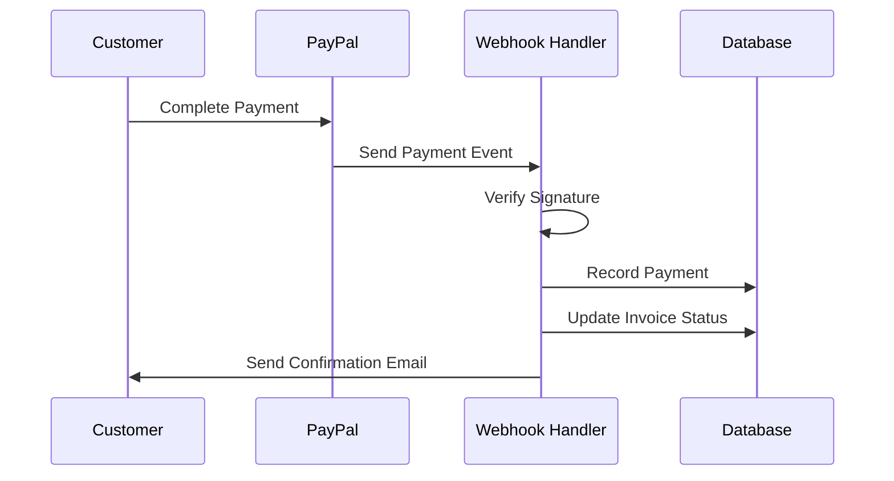

# PayPal Payment Integration - Complete Plan & Implementation

## 🚀 Executive Summary

This document outlines the complete plan and implementation for integrating PayPal payment functionality into our multi-tenant SaaS invoicing system (Flowvya). The integration provides customers with PayPal payment links for invoices and automatically records payments against invoices.

## 📋 Current System Analysis

### Existing Payment Infrastructure
- **Multi-tenant SaaS architecture** with tenant data isolation
- **Invoice management system** with customizable templates
- **Stripe integration** (optional - can be simplified to PayPal-only)
- **Payment recording and reconciliation** system
- **Client management** with payment preferences

### Database Schema (Current)
```sql
-- Core tables already exist:
invoice (id, invoice_number, client_id, total_amount, status, tenant_id)
payment (id, invoice_id, amount, payment_method, tenant_id)
client (id, name, email, payment_preferences, tenant_id)
tenant (id, name, settings, subscription_status)
```

## 🎯 Integration Objectives

1. **Simple PayPal Onboarding**: Users provide PayPal business account credentials
2. **Payment Link Generation**: Create PayPal payment links for any invoice
3. **Automatic Payment Recording**: Webhook-based payment confirmation and recording
4. **Multi-Tenant Support**: Complete tenant isolation and security
5. **Optional Integration**: PayPal as additional payment method (alongside existing options)

## 🏗️ Technical Architecture Plan

### Phase 1: Database Extensions
```sql
-- Add PayPal support to existing invoice table
ALTER TABLE invoice ADD COLUMN paypal_payment_link_id VARCHAR(255);
ALTER TABLE invoice ADD COLUMN paypal_payment_link_url TEXT;
ALTER TABLE invoice ADD COLUMN paypal_order_id VARCHAR(255);

-- PayPal configuration per tenant
CREATE TABLE paypal_config (
    id UUID PRIMARY KEY DEFAULT gen_random_uuid(),
    tenant_id UUID REFERENCES tenant(id) ON DELETE CASCADE,
    environment VARCHAR(20) DEFAULT 'sandbox', -- 'sandbox' or 'live'
    client_id VARCHAR(255) NOT NULL,
    client_secret_encrypted TEXT,
    is_enabled BOOLEAN DEFAULT false,
    business_email VARCHAR(255),
    webhook_url TEXT,
    created_at TIMESTAMP DEFAULT NOW(),
    updated_at TIMESTAMP DEFAULT NOW(),
    
    CONSTRAINT unique_tenant_paypal UNIQUE(tenant_id)
);

-- Enable RLS (Row Level Security)
ALTER TABLE paypal_config ENABLE ROW LEVEL SECURITY;
```

### Phase 2: PayPal Service Layer
```typescript
// lib/paypal-service.ts
export interface PayPalConfig {
  clientId: string;
  clientSecret: string;
  environment: 'sandbox' | 'live';
  businessEmail: string;
}

export class PayPalService {
  constructor(private config: PayPalConfig) {}
  
  // Core payment functionality
  async createPaymentLink(invoiceData: InvoiceData): Promise<PayPalPaymentLink>
  async getAccessToken(): Promise<string>
  async createOrder(orderData: PayPalOrderData): Promise<PayPalOrder>
  async capturePayment(orderId: string): Promise<PayPalPayment>
  
  // Webhook handling
  async verifyWebhookSignature(headers: any, body: string): Promise<boolean>
  async processWebhookEvent(event: PayPalWebhookEvent): Promise<void>
}
```

### Phase 3: API Endpoints

#### PayPal Payment Link API
```typescript
// app/api/invoices/paypal-payment-link/route.ts
export async function POST(request: NextRequest) {
  // 1. Validate user and tenant
  // 2. Get invoice data
  // 3. Create PayPal order
  // 4. Generate payment link
  // 5. Update invoice with PayPal details
  // 6. Return payment link URL
}
```

#### PayPal Webhook Handler
```typescript
// app/api/webhooks/paypal/route.ts
export async function POST(request: NextRequest) {
  // 1. Verify webhook signature
  // 2. Extract tenant from webhook URL
  // 3. Process payment event
  // 4. Update invoice status
  // 5. Record payment in database
  // 6. Send confirmation notifications
}
```

#### PayPal Settings API
```typescript
// app/api/paypal/settings/route.ts
export async function GET() { /* Get PayPal configuration */ }
export async function POST() { /* Save PayPal configuration */ }
export async function PUT() { /* Update PayPal configuration */ }
```

### Phase 4: Frontend Components

#### PayPal Settings Page
```typescript
// app/dashboard/paypal-settings/page.tsx
export default function PayPalSettings() {
  // PayPal onboarding form with:
  // - Environment selection (Sandbox/Live)
  // - Client ID and Secret input
  // - Business email configuration
  // - Connection testing
  // - Enable/disable toggle
}
```

#### Enhanced Payment Link Manager
```typescript
// Components update to support PayPal
interface PaymentLinkManagerProps {
  invoice: Invoice;
  providers: ('stripe' | 'paypal')[];
}

// Features:
// - Provider selection dropdown
// - PayPal-specific styling
// - Multiple payment link support
```

## 🔒 Security & Multi-Tenancy

### Data Isolation
- **Row Level Security (RLS)** on all PayPal tables
- **Tenant-scoped webhook URLs**: `/api/webhooks/paypal/{tenant_id}`
- **Encrypted credential storage** for PayPal client secrets
- **Cross-tenant access prevention** in all APIs

### Security Measures
- **PayPal webhook signature verification** using PayPal's signing key
- **HTTPS-only webhook endpoints** with proper certificate validation
- **Rate limiting** on payment APIs to prevent abuse
- **Audit logging** for all payment-related activities

### Access Control
- **Role-based access**: Only tenant owners/admins can configure PayPal
- **API key rotation** support for enhanced security
- **Environment separation** (sandbox vs live) with clear indicators

## 💳 Payment Flow Design

### Customer Payment Journey
1. **Invoice received** with PayPal payment link
2. **Click PayPal link** → redirected to PayPal checkout
3. **Complete payment** using PayPal account or card
4. **Payment confirmation** → automatic redirect to success page
5. **Invoice updated** to "Paid" status automatically

### Backend Processing Flow


## 🎨 User Experience Design

### PayPal Onboarding Flow
1. **Welcome Screen**: Introduction to PayPal integration benefits
2. **Account Setup**: Simple form for PayPal business account details
3. **Configuration Test**: Verify connection to PayPal
4. **Completion**: Confirmation with next steps

### Invoice Management Integration
- **Payment Link Section**: Alongside existing payment options
- **Provider Selection**: Dropdown to choose PayPal or other methods
- **Status Indicators**: Clear visual feedback for PayPal payment status
- **Bulk Operations**: Generate PayPal links for multiple invoices

## 📊 Implementation Timeline

### Week 1: Foundation
- [ ] Database schema updates
- [ ] PayPal service layer implementation
- [ ] Basic API endpoints

### Week 2: Core Features
- [ ] Payment link generation
- [ ] Webhook processing
- [ ] Payment recording system

### Week 3: User Interface
- [ ] PayPal settings page
- [ ] Payment link manager updates
- [ ] Invoice form integration

### Week 4: Testing & Polish
- [ ] End-to-end testing
- [ ] Error handling refinement
- [ ] Documentation and deployment

## 🧪 Testing Strategy

### Development Testing
- **PayPal Sandbox**: Use PayPal's sandbox environment for all testing
- **Mock Payments**: Test payment flows with test credentials
- **Webhook Simulation**: Use PayPal webhook simulator for event testing

### Integration Testing
- **Multi-tenant Isolation**: Verify tenant data separation
- **Payment Reconciliation**: Test automatic payment matching
- **Error Scenarios**: Test failed payments, webhooks, and edge cases

### User Acceptance Testing
- **Onboarding Flow**: Test PayPal setup process
- **Payment Links**: End-to-end customer payment testing
- **Invoice Management**: Test invoice status updates and notifications

## 🚀 Production Deployment

### Environment Configuration
```bash
# Environment Variables Required
PAYPAL_CLIENT_ID=your_live_client_id
PAYPAL_CLIENT_SECRET=your_live_client_secret
PAYPAL_ENVIRONMENT=live
PAYPAL_WEBHOOK_ID=your_webhook_id
```

### PayPal Developer Setup Required
1. **Create PayPal Developer Account**: https://developer.paypal.com/
2. **Create App**: Get Client ID and Secret for live environment
3. **Configure Webhooks**: Set webhook URL for payment events
4. **Verify Webhook Signing**: Ensure webhook signature verification works

### Monitoring & Alerting
- **Payment Success/Failure Rates**: Monitor via dashboard
- **Webhook Processing**: Alert on webhook failures
- **API Response Times**: Monitor PayPal API performance
- **Error Tracking**: Log and alert on payment processing errors

## 📈 Business Benefits

### For Tenants (Your Customers)
- **Additional Payment Method**: Expand payment options for their customers
- **Global Reach**: PayPal's international presence
- **Trust Factor**: PayPal brand recognition and security
- **Simplified Setup**: Quick onboarding process

### For End Customers (Invoice Recipients)
- **Familiar Payment Experience**: PayPal's trusted checkout
- **Multiple Payment Options**: PayPal balance, cards, bank accounts
- **Mobile Optimized**: PayPal's mobile-friendly payment flow
- **Buyer Protection**: PayPal's purchase protection policies

### For Your Platform
- **Competitive Advantage**: Multiple payment provider support
- **Revenue Growth**: Enable more successful payments
- **Customer Retention**: Satisfy diverse payment preferences
- **Market Expansion**: Support international customers better

## 🔧 Maintenance & Support

### Ongoing Maintenance Tasks
- **API Version Updates**: Keep PayPal SDK up to date
- **Security Patches**: Regular security review and updates
- **Performance Monitoring**: Track payment processing performance
- **User Support**: Handle PayPal-related customer inquiries

### Documentation for Users
- **Setup Guide**: Step-by-step PayPal integration instructions
- **Troubleshooting**: Common issues and solutions
- **Best Practices**: Optimize payment success rates
- **API Documentation**: For developers using your platform

## 🎯 Success Metrics

### Technical Metrics
- **Payment Success Rate**: Target >95% for PayPal payments
- **Webhook Processing Time**: <2 seconds average
- **API Response Time**: <1 second for payment link generation
- **Error Rate**: <1% for payment processing

### Business Metrics
- **Adoption Rate**: Percentage of tenants enabling PayPal
- **Payment Volume**: Total PayPal payment volume processed
- **Customer Satisfaction**: Feedback on PayPal payment experience
- **Revenue Impact**: Additional revenue from improved payment success

---

## ✅ Implementation Status

This plan provides a comprehensive roadmap for integrating PayPal payments into your multi-tenant SaaS invoicing system. The implementation follows security best practices, maintains tenant isolation, and provides a smooth user experience for both tenants and their customers.

**Next Steps:**
1. Review and approve this integration plan
2. Begin Phase 1 implementation with database changes
3. Set up PayPal developer account and sandbox environment
4. Start development following the outlined architecture

**Total Estimated Timeline:** 4 weeks for complete implementation
**Resources Required:** 1 full-stack developer + QA testing support
**Risk Level:** Low (well-defined APIs and clear implementation path)